# Завдання 3. Граф знань для рекомендаційної системи (Neo4j + MovieLens 1M)

Рекомендаційний рушій на графовій БД **Neo4j 5.18** з бібліотеками **APOC** і
**Graph Data Science (GDS)**. Дані — [MovieLens 1M](https://grouplens.org/datasets/movielens/1m/):
**6 040** користувачів, **3 883** фільми, **1 000 209** оцінок (1–5), 18 жанрів,
демографія користувачів.

> Усі скриншоти результатів — у папці `screenshots/` (підключені нижче по тексту).
> Числа в README — фактичні, з реального запуску на повному датасеті (6040 / 3883 /
> 1 000 209). Запуск: локальний Docker (Neo4j 5.18, heap 8G — піднятий під важкі
> агрегації Частини 5).

---

## Структура репозиторію

```
.
├── docker-compose.yml          # локальний запуск Neo4j (APOC + GDS)
├── convert.py                  # конвертація .dat → .csv (latin-1 → utf-8, :: → ,)
├── import/                     # CSV для LOAD CSV (генерує convert.py)
│   ├── movies.csv
│   ├── users.csv
│   └── ratings.csv
├── queries/
│   ├── part2_load.cypher       # індекси + завантаження вузлів і ребер
│   ├── part3.cypher            # 6 запитів частини 3
│   ├── part4_supernodes.cypher # пошук супервузлів
│   └── part5_gds.cypher        # PageRank, Louvain, Dijkstra
├── screenshots/                # скриншоти результатів
└── README.md
```

---

## Як відтворити (Варіант A — Docker)

```bash
# 1. Підняти Neo4j (перший старт качає плагіни APOC+GDS, ~1–2 хв)
docker-compose up -d

# 2. Завантажити та розпакувати датасет у data/ml-1m/
curl -o /tmp/ml-1m.zip https://files.grouplens.org/datasets/movielens/ml-1m.zip
unzip /tmp/ml-1m.zip -d data/

# 3. Конвертувати .dat → import/*.csv
python3 convert.py

# 4. Відкрити Neo4j Browser:  http://localhost:7474
#    Логін: neo4j / Пароль: password123
#    Виконати по черзі блоки з queries/part2_load.cypher

# (альтернатива кроку 4 — одразу через cypher-shell:)
cat queries/part2_load.cypher | docker exec -i neo4j_movielens \
    cypher-shell -u neo4j -p password123
```

> **Пам'ять.** `docker-compose.yml` ставить heap Neo4j = 8G (і `transaction.total.max`
> = 6G) — це потрібно для важких агрегацій Частини 5. Виділи Docker Desktop ≥ 12 GB
> (Settings → Resources → Memory). Якщо RAM мало — лиши heap 2G: запити схожості
> користувачів у Частині 5 уже написані «легкими» (`rating = 5` + викид блокбастерів
> `numRatings < 500`), тож вони влазять і в менший ліміт.
>
> AuraDB (Варіант B) теж підходить: APOC і GDS там вже є. На безкоштовному рівні
> (~200 MB) візьми підмножину — перші 200 000 рядків `ratings.dat`.

---

## Довідник кодів (для інтерпретації скриншотів)

Демографію MovieLens зберігає кодами (так у датасеті). Розшифровка:

**Age (вікова група):** `1` Under 18 · `18` 18-24 · `25` 25-34 · `35` 35-44 ·
`45` 45-49 · `50` 50-55 · `56` 56+

**Occupation:** `0` other · `1` academic/educator · `2` artist · `3` clerical/admin ·
`4` college/grad student · `5` customer service · `6` doctor/health care ·
`7` executive/managerial · `8` farmer · `9` homemaker · `10` K-12 student ·
`11` lawyer · `12` programmer · `13` retired · `14` sales/marketing ·
`15` scientist · `16` self-employed · `17` technician/engineer ·
`18` tradesman/craftsman · `19` unemployed · `20` writer

---

# Частина 1 — Проєктування схеми

## Схема графа (ASCII)

```
        ┌────────────────────────────┐
        │            User            │
        │  userId  (UNIQUE, int)     │
        │  gender  ('M' | 'F')       │
        │  age     (int, код групи)  │
        │  occupation (int, код)     │
        └────────────┬───────────────┘
                     │
                     │  RATED  { rating: int (1..5),
                     │           timestamp: int (unix) }
                     ▼
        ┌────────────────────────────┐        HAS_GENRE     ┌──────────────┐
        │           Movie            │ ───────────────────► │    Genre     │
        │  movieId (UNIQUE, int)     │                      │ name (UNIQUE)│
        │  title   (string)          │                      └──────────────┘
        │  year    (int)             │      (18 вузлів-жанрів — спільні хаби)
        │  numRatings (int, кеш)*    │
        └────────────────────────────┘
* numRatings — денормалізований лічильник оцінок (додається у Частині 5 для
  пришвидшення; до базової схеми не обов'язковий).
```

**Вузли:** `User`, `Movie`, `Genre`.
**Ребра:** `(User)-[:RATED {rating, timestamp}]->(Movie)` та
`(Movie)-[:HAS_GENRE]->(Genre)`.

Скриншот: схема з Neo4j Browser (`CALL db.schema.visualization()`):

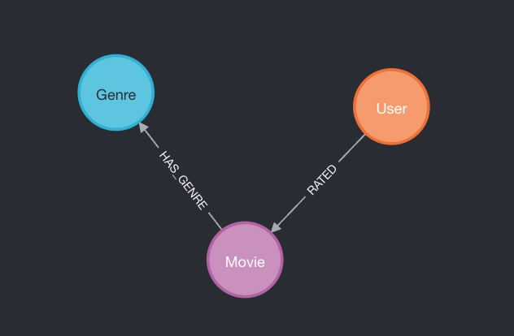

## Відповіді на питання Частини 1

**1. Які сутності стали вузлами, а які — ребрами? Чому?**
Вузлами стали `User`, `Movie`, `Genre` — це самостійні сутності з власною
ідентичністю, які беруть участь у багатьох зв'язках і про які ставлять запити
самі по собі («покажи фільм», «знайди користувача»). Ребром стала **оцінка**
(`RATED`): вона не існує сама по собі, а лише як факт «користувач X оцінив фільм
Y» — тобто зв'язок між двома вузлами з атрибутами `rating` і `timestamp`. Жанр —
вузол (а не атрибут), бо це обмежений довідник (18 значень), спільний для тисяч
фільмів, по якому ми хочемо ходити в обидва боки.

**2. Оцінка — це ребро `RATED` чи окремий вузол `Rating`? (trade-off)**
Обрано **ребро** `(:User)-[:RATED {rating, timestamp}]->(:Movie)`.

*Чому ребро (плюси):* оцінка концептуально і є зв'язком user та movie; обхід
`(:User)-[:RATED]->(:Movie)` — один хоп, мінімум пам'яті на 1 млн фактів; усі наші
запити (рекомендації, схожість, шляхи) — це саме навігація user та movie, де ребро
найприродніше і найшвидше.

*Мінуси ребра:* у Neo4j ребро **не може мати власних ребер** — до оцінки не
«причепиш» інші вузли (тег, рецензію, сесію перегляду, джерело). Реіфікація
(винесення в окремий вузол) дала б цю гнучкість.

*Альтернатива — вузол `Rating`:* `(:User)-[:GAVE]->(:Rating)-[:OF]->(:Movie)`.
*Плюси:* оцінка стає повноцінною сутністю — можна додати `(:Rating)-[:HAS_TAG]->(:Tag)`,
`(:Rating)-[:IN]->(:Session)`, окремо індексувати її як вузол, версіонувати.
*Мінуси:* +1 000 000 вузлів і вдвічі більше ребер; кожен простий обхід user→movie
стає двома хопами; більше пам'яті; усі базові запити багатослівніші й повільніші.

*Висновок:* для нашого навантаження (рекомендації/схожість/шляхи user та movie і
без додаткових даних на оцінці) ребро виграє. Реіфікацію в `Rating` робили б лише
тоді, коли до оцінки треба чіпляти ще щось (рецензії, теги, контекст перегляду).

**3. Чому жанри — окремі вузли `Genre`, а не список у властивості `Movie`?**
- **Індекс і швидкий доступ в обидва боки.** `(:Genre {name:'Thriller'})<-[:HAS_GENRE]-(m)`
  стартує з одного вузла по unique-індексу й одразу дає всі трилери. Зі списком
  `m.genres` довелося б сканувати **всі** фільми з `WHERE 'Thriller' IN m.genres`.
- **Зв'язки між фільмами через жанр «безкоштовно».** «Фільми того ж жанру»,
  «спільні жанри двох фільмів», жанрові профілі спільнот (Частина 5) — це обходи
  по `HAS_GENRE`, неможливі для значення-списку.
- **Дедуплікація і цілісність.** 18 канонічних значень в одному місці замість
  повторення рядків у 3 883 фільмах; жоден «Thriller»-одрук не розмножиться.
- **Граф-аналітика.** Жанр як вузол стає хабом, який можна аналізувати (ступінь,
  централність) — див. супервузли в Частині 4.

---

# Частина 2 — Завантаження даних

Усі запити — у [`queries/part2_load.cypher`](queries/part2_load.cypher).

**Конвертація (`convert.py`).** Файли MovieLens мають роздільник `::` і кодування
`latin-1`. Скрипт читає їх як `latin-1`, пише `UTF-8` CSV через `csv.writer`, який
сам бере в лапки поля з комами (`American President, The (1995)`) та апострофами
(`Children's`) — тож `LOAD CSV WITH HEADERS` прочитає їх коректно. Для `users`
відкидаємо zip (не потрібен).

**1. Constraints = індекси.**
```cypher
CREATE CONSTRAINT user_id  IF NOT EXISTS FOR (u:User)  REQUIRE u.userId  IS UNIQUE;
CREATE CONSTRAINT movie_id IF NOT EXISTS FOR (m:Movie) REQUIRE m.movieId IS UNIQUE;
CREATE CONSTRAINT genre_name IF NOT EXISTS FOR (g:Genre) REQUIRE g.name  IS UNIQUE;
```
Unique-constraint у Neo4j **автоматично створює індекс**, тому ми одночасно
(а) гарантуємо унікальність → `MERGE` не дублює вузли при повторному запуску і
(б) отримуємо індекс, який робить пошук вузла миттєвим. Створюємо **до**
завантаження ребер — інакше кожен з мільйона `MATCH` робив би full scan.

**2. Вузли User / Movie+Genre.** `MERGE` (не `CREATE`) — ідемпотентність.
`toInteger(...)` бо CSV дає рядки. `year` витягуємо з назви
(`substring(title, size-5, 4)` — усі назви закінчуються на `(РРРР)`). Жанри
розбиваємо `split(genres,'|')`, через `UNWIND` створюємо вузли `Genre` і ребра
`HAS_GENRE`.

**3. Ребра RATED — батчами.** 1 000 209 ребер однією транзакцією впадуть по
пам'яті/таймауту, тому `apoc.periodic.iterate` ріже роботу на батчі по 10 000:
driver-запит стримить рядки CSV, worker-запит для кожного рядка робить `MATCH`
вузлів (швидко завдяки індексам) і `MERGE` ребра. `parallel:false`, бо worker
покладається на коректний пошук/блокування вузлів — паралельність тут ризикована
заради невеликого виграшу.

Скриншот: вивід перевірки (count вузлів і ребер):

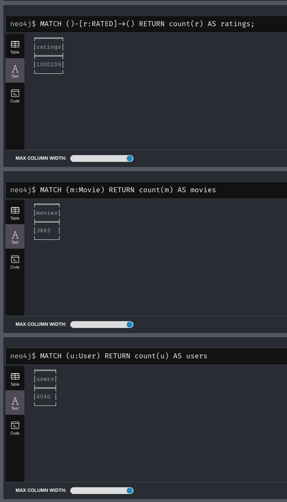
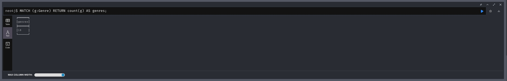

Фактичні числа: `users=6040`, `movies=3883`, `genres=18`, `ratings=1000209` — усе збіглося з очікуваним.

---

# Частина 3 — Запити різної складності

Усі запити — у [`queries/part3.cypher`](queries/part3.cypher).

### Запит 1. Трилери із середнім рейтингом > 4.0
```cypher
MATCH (m:Movie)-[:HAS_GENRE]->(:Genre {name: 'Thriller'})
MATCH (m)<-[r:RATED]-()
WITH m, avg(r.rating) AS avgRating, count(r) AS numRatings
WHERE avgRating > 4.0
RETURN m.title AS title, round(avgRating, 2) AS avgRating, numRatings
ORDER BY avgRating DESC, numRatings DESC;
```
Стартуємо з вузла-жанру (індекс по `name`), беремо його фільми, збираємо їхні
оцінки й рахуємо середнє. `numRatings` лишаємо у виводі навмисно: показує, на
скількох оцінках стоїть середнє (фільм з 3×5.0 формально пройде поріг, але це шум —
видно одразу).

Скриншот: 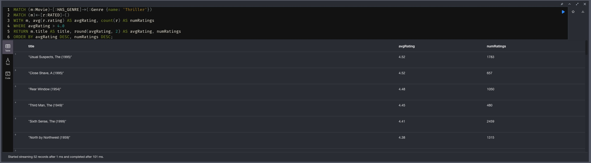

**Результат:** 52 трилери з avg > 4.0. Нагорі `The Usual Suspects (1995)` — 4.52
(1783 оцінки), `A Close Shave (1995)` — 4.52 (657), `Rear Window (1954)` — 4.48
(1050), `The Sixth Sense (1999)` — 4.41 (2459).

### Запит 2. Користувачі з оцінкою «5» більш ніж 50 фільмам
```cypher
MATCH (u:User)-[r:RATED]->(m:Movie)
WHERE r.rating = 5
WITH u, count(m) AS fives
WHERE fives > 50
RETURN u.userId, u.gender, u.age, u.occupation, fives
ORDER BY fives DESC;
```
Фільтр `rating=5`, групування по користувачу, поріг `fives > 50`. Виводимо
демографію — видно «щедрих оцінювачів».

Скриншот: 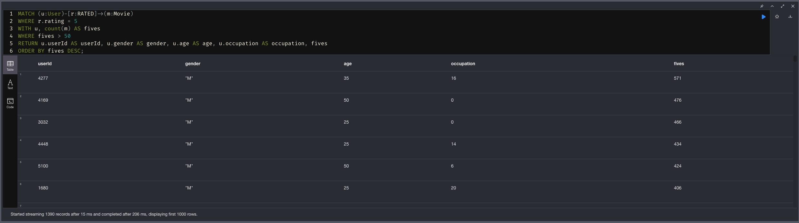

**Результат:** 1390 користувачів поставили «5» понад 50 фільмам. Нагорі — userId
`4277` (571), `4169` (476), `3032` (466), `4448` (434). Прикметно: `4277` і `4448` —
це ті самі хаб-користувачі, через яких Dijkstra прокладає шляхи у Частині 5.3 (їхня
гіперактивність робить їх центрами графа схожості).

### Запит 3. Фільми, які обидва (userId=1 і =2) оцінили високо (≥4)
```cypher
MATCH (u1:User {userId:1})-[r1:RATED]->(m:Movie)<-[r2:RATED]-(u2:User {userId:2})
WHERE r1.rating >= 4 AND r2.rating >= 4
RETURN m.title, r1.rating AS user1Rating, r2.rating AS user2Rating
ORDER BY m.title;
```
Один патерн ловить **спільного сусіда** двох користувачів — у графі це одна лінія
замість самоз'єднання таблиці у SQL.

Скриншот: 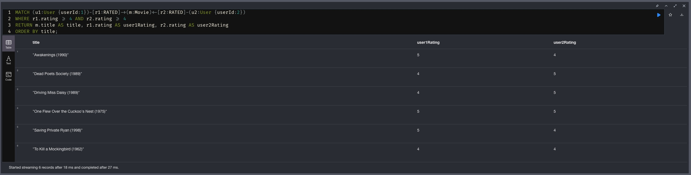

**Результат:** користувачі 1 і 2 спільно високо оцінили 6 фільмів — `Awakenings (1990)`,
`Dead Poets Society (1989)`, `Driving Miss Daisy (1989)`, `One Flew Over the Cuckoo's
Nest (1975)`, `Saving Private Ryan (1998)`, `To Kill a Mockingbird (1962)` (обидва —
любителі драм).

### Запит 4. Жанри зі стабільно високими оцінками
```cypher
MATCH (g:Genre)<-[:HAS_GENRE]-(m:Movie)<-[r:RATED]-()
WITH g, avg(r.rating) AS avgRating, count(r) AS numRatings
RETURN g.name, round(avgRating,3) AS avgRating, numRatings
ORDER BY avgRating DESC;
```
Агрегація по жанру: і середнє, і обсяг. «Стабільно високий» = і високе середнє, і
велика кількість оцінок (а не 4.5 на 20 оцінках).

Скриншот: 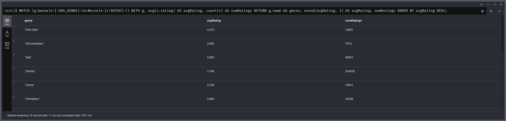

**Результат:** нагорі `Film-Noir` — 4.075 (18 261 оцінка), `Documentary` — 3.933
(7 910), `War` — 3.893 (68 527), `Drama` — 3.766 (354 529), `Crime` — 3.709 (79 541).
Тобто найвище й стабільно оцінюють нішеві якісні жанри (Film-Noir, Documentary), а
наймасовіша `Drama` тримає високе середнє на величезному обсязі.

### Запит 5. Рекомендації «схожі смаки також дивилися» (collaborative filtering)
```cypher
MATCH (target:User {userId:1})-[:RATED]->(seen:Movie)
WITH target, collect(DISTINCT seen) AS seenMovies
MATCH (target)-[r1:RATED]->(shared:Movie)<-[r2:RATED]-(peer:User)
WHERE r1.rating >= 4 AND r2.rating >= 4 AND peer <> target
WITH target, seenMovies, peer, count(shared) AS overlap
ORDER BY overlap DESC LIMIT 50
MATCH (peer)-[r3:RATED]->(rec:Movie)
WHERE r3.rating >= 4 AND NOT rec IN seenMovies
WITH rec, count(DISTINCT peer) AS peers, avg(r3.rating) AS avgPeerRating
RETURN rec.title, peers, round(avgPeerRating,2) AS avgPeerRating
ORDER BY peers DESC, avgPeerRating DESC LIMIT 10;
```
Три кроки: (1) усе, що користувач **уже бачив**; (2) топ-50 **схожих** користувачів
за кількістю спільних уподобань (`overlap`); (3) фільми, які ці сусіди оцінили
високо, а цільовий ще НЕ бачив — ранжовані за кількістю «порадників». Це класичний
user-based CF одним обходом графа.

Скриншот: 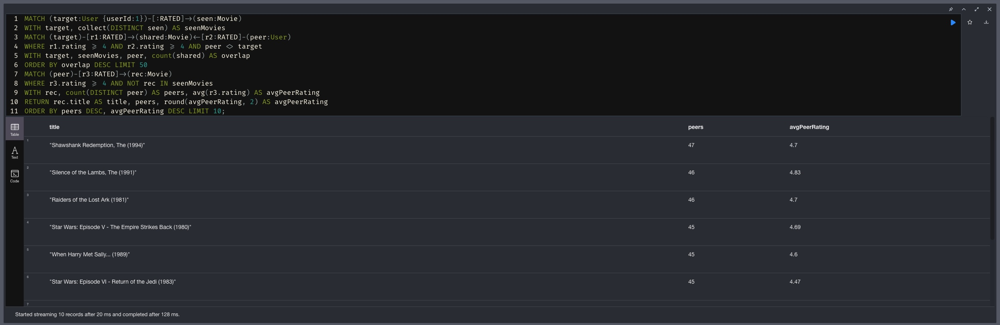

**Результат (для userId=1):** топ рекомендацій — `The Shawshank Redemption (1994)`
(47 схожих радять, avg 4.7), `The Silence of the Lambs (1991)` (46, 4.83),
`Raiders of the Lost Ark (1981)` (46, 4.7), `Star Wars: Episode V (1980)` (45, 4.69),
`When Harry Met Sally (1989)` (45, 4.6). Усе — фільми, яких користувач 1 ще не
оцінював, але які люблять його «сусіди по смаку».

### Запит 6. Найкоротший ланцюжок між двома користувачами
```cypher
MATCH (u1:User {userId:1}), (u2:User {userId:5000})
MATCH p = shortestPath((u1)-[:RATED*..6]-(u2))
RETURN [n IN nodes(p) | CASE WHEN n:User THEN 'User '+toString(n.userId)
                             WHEN n:Movie THEN 'Movie '+n.title END] AS chain,
       length(p) AS pathLength;
```
`shortestPath` по ребрах `RATED` без напрямку (бо ходимо User→Movie→User). `*..6`
обмежує глибину. Ланцюжок чергує користувачів і фільми.

Скриншот: 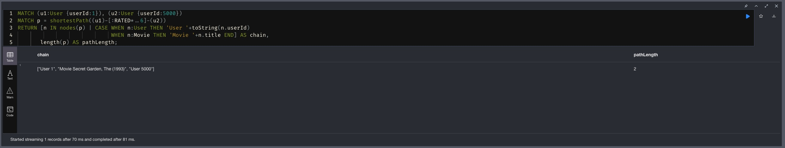

**Результат:** `User 1 → "Secret Garden, The (1993)" → User 5000`, довжина **2** —
користувачі 1 і 5000 зчеплені одним спільним фільмом (на сирому графі `RATED`
світ дуже тісний; пор. Частину 5.3).

## Відповіді на питання Частини 3 (довжина шляху)

1. **Що означає довжина шляху?** Це кількість пройдених ребер `RATED` між двома
   користувачами. Оскільки ребро завжди веде User та Movie, шлях чергується
   `User–Movie–User–Movie–…–User`, тому довжина між двома користувачами завжди
   **парна**.
2. **1 хоп = 1 крок по ребру `RATED`.** Отже шлях **довжини 2** означає
   `User1–Movie–User2`: обидва користувачі оцінили **один і той самий фільм**
   (прямий спільний інтерес).
3. **Довжина 4** — `User1–Movie_a–User_x–Movie_b–User2`: прямого спільного фільму
   немає, але є **посередник** `User_x`, який ділить фільм `Movie_a` з User1 і
   фільм `Movie_b` з User2 («знайомий знайомого» через фільми).
   **Довжина 6** — два посередники поспіль: ще опосередкованіший зв'язок
   (User1 → фільм → user → фільм → user → фільм → User2). Що більша довжина, то
   слабший/непрямі́ший зв'язок між смаками двох людей.

---

# Частина 4 — Виявлення супервузлів

Усі запити — у [`queries/part4_supernodes.cypher`](queries/part4_supernodes.cypher).

**Крок 1 — топ-20 вузлів за ступенем** (`COUNT { (n)--() }`).
**Крок 2 — розподіл ступеня по лейблах** (max/avg/p99).
**Крок 3 — жанри окремо** (скільки фільмів на кожному жанрі).
**Крок 4 — найрейтинговіші фільми** (демонстрація проблеми обходу).

Скриншот: топ-20 за ступенем 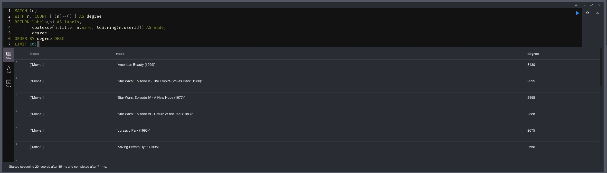

Скриншот: розподіл по лейблах 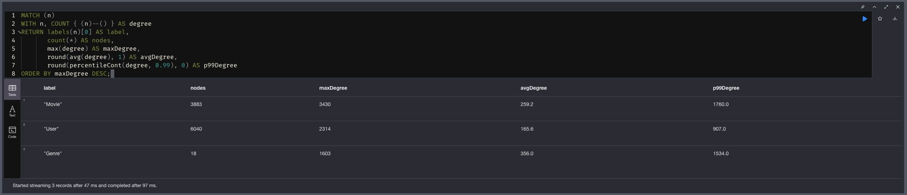

Скриншот: жанри-хаби 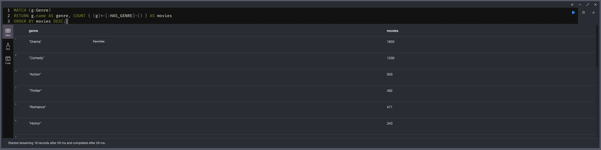

Скриншот: найрейтинговіші фільми (демонстрація проблеми) 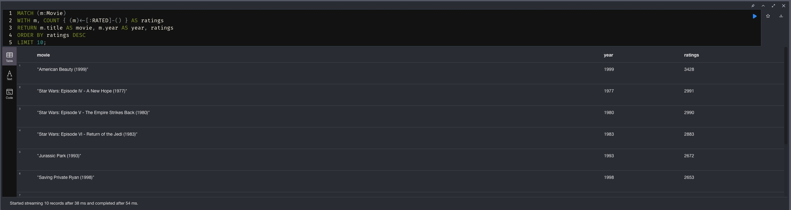

## Відповіді на питання Частини 4

**1. Які вузли — супервузли? Скільки зв'язків? (фактичні числа)**
Виявилися три типи (ступінь = к-сть інцидентних ребер):
- **Найпопулярніші фільми** (ребра `RATED`) — найбільші супервузли:
  `American Beauty (1999)` — **3430**, `Star Wars: Episode V (1980)` — **2995**,
  `Star Wars: Episode IV (1977)` — **2995**, `Star Wars: Episode VI (1983)` — **2888**,
  `Jurassic Park (1993)` — **2675**, `Saving Private Ryan (1998)` — **2656**.
- **Жанрові вузли — структурні хаби** (ребра `HAS_GENRE`): `Drama` — **1603** фільмів,
  `Comedy` — **1200**, `Action` — **503**, `Thriller` — **492**, `Romance` — **471**,
  `Horror` — **343**. Усі 18 жанрів — супервузли.
- **Найактивніші користувачі**: максимум **2314** оцінок в одного користувача.

Розподіл ступеня по лейблах (крок 2) підтверджує масштаб: **Movie** — max **3430**,
avg 259.2, p99 1760; **Genre** — max **1603**, avg 356.0 (вузлів лише 18, але кожен
гігантський); **User** — max **2314**, avg 165.6, p99 907.

**2. Чому запит, що зачіпає супервузол, повільніший за «звичайний» при тих самих
індексах?** Індекс пришвидшує **знаходження** стартового вузла (point lookup), але
не сам **обхід** його ребер. Дійшовши до супервузла, Cypher має розгорнути **всі**
його зв'язки. Приклад: `(:User)-[:RATED]->(m)<-[:RATED]-(other)` через
`American Beauty` (≈3400 оцінок) породжує ≈3400 сусідніх користувачів, а патерн
«спільний фільм» → ≈3400×3400 ≈ **11.5 млн** пар лише на одному фільмі. Вартість
росте з **ступенем** вузла, і жоден індекс цього не прибирає — обхід за
визначенням пропорційний кількості ребер. Тому шляхи/рекомендації, що проходять
крізь хаби, «вибухають» комбінаторно.

**3. Яку стратегію застосувати для цього датасету?**
- **Жанрові вузли — це навмисні «хороші» супервузли**: 18 хабів — нормально для
  довідника, їх не дробимо. Але **уникаємо обходів user→genre→…→user через
  жанр**: «фільми того ж жанру» легко дає мільйони пар. Стратегія: не ходити крізь
  жанр як міст між сутностями; для фільтрації використовувати жанр як **точку
  входу** (стартувати з `Genre`), а не транзитний вузол.
- **Поріг/фільтр на вході** (застосовано в Частині 5, і це не теорія — без цього
  запит схожості користувачів падав по пам'яті, OOM на 1.4 GiB): для графа схожості
  користувачів ми рахували тільки по оцінках `= 5` і **виключили фільми-супервузли**
  (`m.numRatings < 500`). Спільна любов до блокбастера — слабкий сигнал смаку (всі
  люблять Star Wars), як IDF у пошуку; її викид одночасно прибирає квадратичний
  вибух пар. Для графа фільмів (5.1), навпаки, лишали популярні (`numRatings>20`) і
  обмежували `LIMIT 50000`.
- **Денормалізація лічильників**: `m.numRatings` уникає повторного обходу всіх
  ребер фільму.
- **Окреме ребро для «сильних» зв'язків** (напр. `:LIKED` для rating≥4) — обхід
  ходить меншим підграфом, не чіпаючи всі оцінки супервузла.
- За потреби — **семантичне дроблення** (категоризація ребер за часом/типом), щоб
  обхід брав лише релевантну підмножину ребер хаба.

---

# Частина 5 — Графові алгоритми (GDS)

Усі запити — у [`queries/part5_gds.cypher`](queries/part5_gds.cypher). GDS працює з
**проєкцією в пам'яті**, тож кожен алгоритм: матеріалізувати ребра → спроєктувати
→ запустити → прибрати.

## 5.1. PageRank на графі фільмів

Будуємо ребра `CO_RATED` (фільми, які високо оцінили спільні користувачі;
`weight` = к-сть таких користувачів), проєктуємо як `UNDIRECTED` і запускаємо
зважений PageRank.

Скриншот: топ-20 фільмів за PageRank 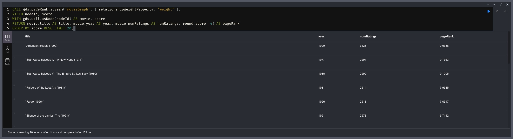

Скриншот: візуалізація графа фільмів 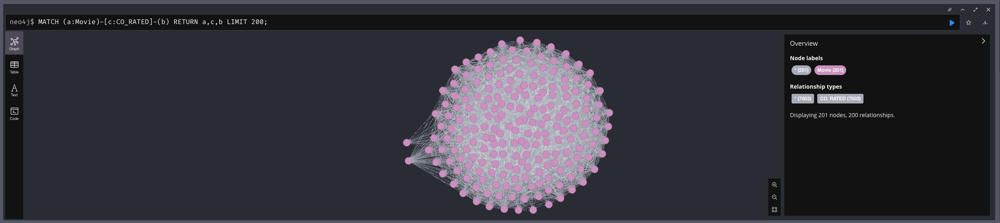

**Питання: що означає високий PageRank тут — це «популярний фільм» чи щось інше?**
Не просто популярність. У графі `CO_RATED` вузол отримує високий PageRank, якщо він
**пов'язаний з багатьма фільмами, які самі добре пов'язані** з рештою графа смаків.
Це фільм-**міст**: його люблять різнопланові аудиторії, тож він «центральний» у
структурі вподобань. Популярність (просто багато оцінок) корелює з цим, але не
тотожна: нішевий фільм з малою к-стю оцінок матиме низький PageRank навіть при
високому середньому; а універсально улюблений масовий фільм (Star Wars, American
Beauty) — високий, бо ділить глядачів майже з усіма кластерами. Тобто PageRank тут
≈ «**центральність у мережі спільних уподобань**», а не сирий лічильник переглядів.

**Наш фактичний топ:** `American Beauty (1999)` — **9.66**, `Star Wars: Episode IV
(1977)` — **9.14**, `Star Wars: Episode V (1980)` — **9.10**, `Raiders of the Lost
Ark (1981)` — **7.94**, `Fargo (1996)` — **7.03**, `The Silence of the Lambs (1991)`
— **6.71**. Це масові «об'єднувачі смаків». Що PageRank ≠ популярність, видно
прямо в таблиці: `Jurassic Park` має більше оцінок (2675), ніж `Fargo` (2513) чи
`Silence of the Lambs` (2578), але **поступається їм за PageRank** — бо Fargo та
Silence of the Lambs сильніше «зшивають» різні аудиторії, тоді як Jurassic Park
з'являється переважно в одному, «блокбастерному» сусідстві.

## 5.2. Виявлення спільнот (Louvain)

Ребра `SIMILAR` будуємо між користувачами, які поставили `5` тим самим фільмам,
**виключивши блокбастери** (`m.numRatings < 500` — див. Частину 4), беремо топ-50000
найважчих ребер. Далі Louvain із записом `community`, 10 найбільших спільнот і топ-3
жанри кожної.

Скриншот: communityCount + modularity 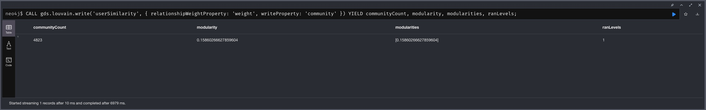

Скриншот: 10 найбільших спільнот (розміри) 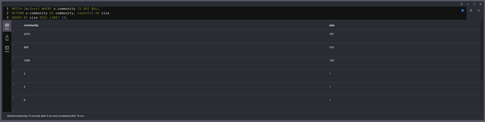

Скриншот: топ-3 жанри по спільнотах 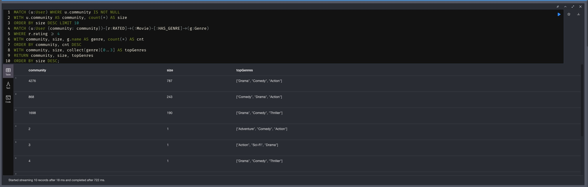

Скриншот: візуалізація спільнот 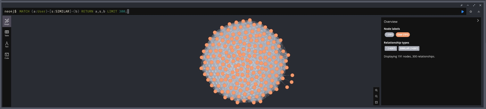

**Фактичні результати.** `communityCount = 4823`, **`modularity = 0.159`**,
`ranLevels = 1`. Але 4823 — оманливе число: реальних спільнот лише **три**, решта —
ізольовані користувачі (кожен сам собі «спільнота» розміру 1). Три великі кластери:

| community | розмір | топ-3 жанри (rating ≥ 4) |
|-----------|--------|--------------------------|
| 4276 | **787** | Drama, Comedy, Action |
| 868 | **243** | Comedy, Drama, Action |
| 1698 | **190** | Drama, Comedy, Thriller |

**Питання 1: чи відповідають кластери інтуїтивним групам?** **Частково.** Чіткого
поділу «бойовики vs арт-хаус» немає: усі три великі спільноти мейнстрімні й
зверху мають ті самі `Drama`/`Comedy`. Відмінності — у третьому, «характерному»
жанрі: спільнота 4276 тяжіє до `Action`, 868 — переважно `Comedy`, 1698 —
вирізняється `Thriller`. Низька **modularity 0.159** це й підтверджує: розбиття
слабке. Причина структурна — після відкидання блокбастерів і обмеження топ-50000
ребрами граф вийшов *зірковим* (hub-and-spoke): лише **1220 із 6040** користувачів
взагалі потрапили у зв'язний компонент, і всі вони зчеплені через кількох
хаб-користувачів, тому межі між кластерами розмиті, а не різкі.

**Питання 2: як це перевірили?** Кроком 4б: для кожної великої спільноти порахували
3 найчастіші жанри серед фільмів, які її учасники оцінили `≥ 4` (таблиця вище).
Те, що профілі жанрів між спільнотами зміщуються (Action  та  Comedy  та  Thriller),
показує, що Louvain групував за смаком, а не випадково; а близькість профілів
пояснює низьку modularity.

## 5.3. Найкоротший шлях між користувачами (Dijkstra)

Та сама проєкція `SIMILAR`. Запускаємо Dijkstra між парою користувачів, дивимось
к-сть проміжних вузлів.

> **Нюанс ваги.** `weight` = к-сть спільних фільмів (більше = ближче), а Dijkstra
> мінімізує **суму** ваг. Тож базовий запуск (як у завданні) шукає шлях з найменшою
> сумарною вагою; для семантики «найсхожіший ланцюжок» коректніше інвертувати вагу
> (`1.0/weight`). У README наведено базовий варіант; в обох випадках **кількість
> хопів** (розмір ланцюжка) — те, що нас цікавить для «тісного світу».

Скриншот: Dijkstra одна пара (17→62) 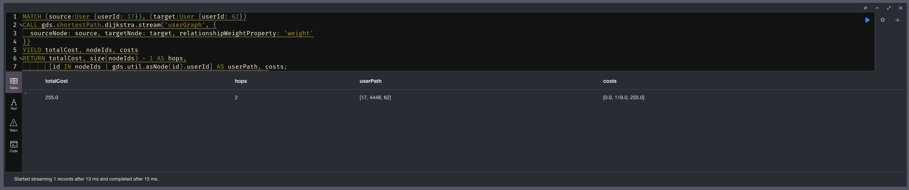

Скриншот: Dijkstra кілька пар 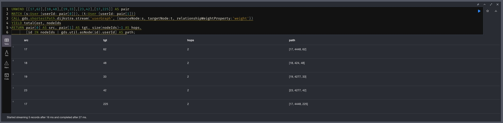

**Структура графа (WCC).** `userGraph` розпадається на **1 великий зв'язний компонент
із 1220 користувачів** і **4820 ізольованих** вузлів. Тому пара `1 та 2` (обидва
ізольовані) дає **порожній** результат — шляху просто нема. Робочі пари беремо з
компонента, напр. `17 та 62`.

**Питання 1: наскільки «тісний світ»?** Усередині компонента — **екстремально
тісний**. Приклад: `17 → 62` = **2 хопи**, шлях `[17, 4448, 62]` (через хаб-користувача
4448, `costs [0, 119, 255]`). Перевірені пари `18 та 48`, `19 та 33`, `23 та 42`, `17 та 225` —
теж по **2 хопи**, майже всі через тих самих хабів `4277`/`4448`. Це знову ефект
супервузлів (Частина 4): кілька гіпер-активних користувачів зчіплюють усіх інших.

**Питання 2: середня довжина шляху? «Шість рукостискань»?** На вибірці зв'язаних
пар розподіл довжин: **1 хоп — 5 пар, 2 хопи — 74 пари, 3 хопи — 2 пари**, тобто
**середня ≈ 2.0**, діаметр компонента = **3**. На сирому графі `RATED` теж тісно:
Запит 6 знайшов `User 1 → "Secret Garden (1993)" → User 5000` — довжина **2** (один
спільний фільм). Гіпотеза «шести рукостискань» тут **сильно перевиконується** (~2 ≪ 6):
завдяки концентрації оцінок на невеликій кількості хабів діаметр графа крихітний.

---

# Частина 6 — Аналіз і висновки

**1. Граф vs SQL: які запити Частини 3 складно/неможливо у SQL?**
Найважчі — **Запит 6** (найкоротший шлях) і **Запит 5** (рекомендації).

*Запит 6 (shortestPath)* — це обхід графа змінної глибини. У SQL це рекурсивний
CTE, який вручну розкриває рівні і має сам ловити цикли та глибину; для пошуку
**найкоротшого** шляху між двома конкретними вузлами по таблиці на 1 млн рядків це
багатослівно і дуже повільно (експоненційне розростання проміжних рядків).
У Cypher — один рядок `shortestPath((a)-[:RATED*..6]-(b))`.

*Запит 5 (CF)* у SQL — ланцюг самоз'єднань таблиці `ratings` (1 млн рядків) саму на
себе кілька разів:
```sql
-- Спрощено: фільми, які люблять "сусіди" користувача 1 і яких він не бачив
SELECT r3.movie_id, COUNT(DISTINCT r2.user_id) AS peers
FROM ratings r1                                   -- що любить user 1
JOIN ratings r2 ON r2.movie_id = r1.movie_id      -- сусіди по спільному фільму
                AND r2.user_id <> 1
JOIN ratings r3 ON r3.user_id = r2.user_id        -- що ще люблять сусіди
WHERE r1.user_id = 1 AND r1.rating >= 4 AND r2.rating >= 4 AND r3.rating >= 4
  AND r3.movie_id NOT IN (SELECT movie_id FROM ratings WHERE user_id = 1)
GROUP BY r3.movie_id
ORDER BY peers DESC
LIMIT 10;
```
Він *існує*, але це 3-4 self-join великої таблиці — важко читати, легко помилитись,
і він масштабується гірше за обхід графа, де «сусід» — це фізичний перехід по ребру,
а не злиття таблиць. Чим довший ланцюг зв'язків, тим виразніше граф виграє.

**2. Де граф програє?** На **масових агрегаціях і звітах через увесь датасет**.
Наприклад: «середній рейтинг по кожному жанру за кожен місяць», зведені
таблиці/пивоти, дашборди, експорт усіх оцінок у CSV/BI, статистика по всій базі.
Це повний скан 1 млн фактів + `GROUP BY` — реляційна (а ще краще колонкова) СУБД
зробить це швидше й простіше: дані лежать таблицею, агрегатні функції та індекси
під такі скани заточені, а зберігання компактніше (нема накладних на зберігання
зв'язків). Граф блищить на **локальних обходах** (від вузла по сусідах), але на
**глобальних агрегаціях без обходу** його перевага зникає, а оверхед на ребра —
лишається.

**3. Покращення схеми — які зміни пришвидшать конкретні запити?**
- **Денормалізація агрегатів на `Movie`** (`numRatings`, `avgRating`): **Запит 1**
  і **Запит 4** перестають щоразу обходити всі ребра `RATED` фільму — середнє вже
  пораховане. (Ціна — підтримувати при нових оцінках; для офлайн-аналітики дешево.)
- **Окреме ребро `:LIKED` для оцінок ≥4** (або relationship-index по `RATED.rating`):
  **Запит 2 (rating=5)**, **Запит 3, 5** фільтрують саме за високими оцінками. Замість
  обходу всіх оцінок з `WHERE r.rating>=4` обхід іде вже по підграфу «вподобань» —
  менше ребер, особливо біля супервузлів. (`CREATE INDEX rated_rating … ON (r.rating)`
  вже додано у `part2_load.cypher` як легший крок до того ж ефекту.)
- *(бонус)* **Індекс по `Movie.year`** для запитів з фільтром за роком; **матеріалізовані
  `CO_RATED`/`SIMILAR`** як постійні ребра, якщо рекомендації рахуються часто.

---

## Скриншоти у репозиторії (`screenshots/`)

| Файл | Що показує |
|------|------------|
| `schema.jpg` | `CALL db.schema.visualization()` |
| `part2_counts_1.jpg`, `part2_counts_2.jpg` | перевірочні count-и (6040/3883/18/1000209) |
| `part3_q1.jpg` … `part3_q6.jpg` | результати 6 запитів Частини 3 |
| `part4_top.jpg`, `part4_bylabel.jpg`, `part4_genres.jpg`, `part4_ratings.jpg` | супервузли |
| `part5_pagerank.jpg`, `part5_movie_graph.jpg` | PageRank + граф фільмів |
| `part5_louvain_stats.jpg`, `part5_communities.jpg`, `part5_community_genres.jpg`, `part5_community_graph.jpg` | Louvain |
| `part5_dijkstra.jpg`, `part5_dijkstra_multy.jpg` | найкоротший шлях (Dijkstra) |
